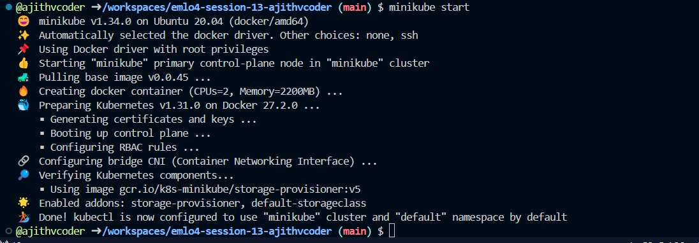
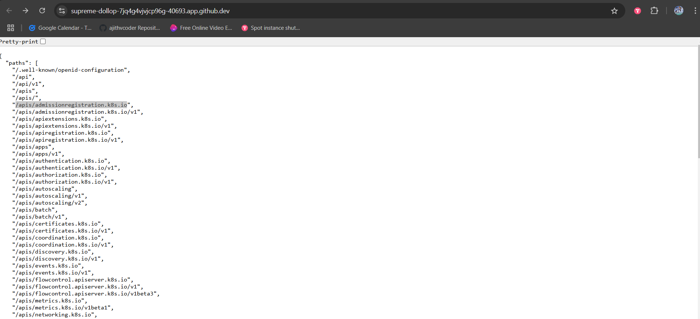
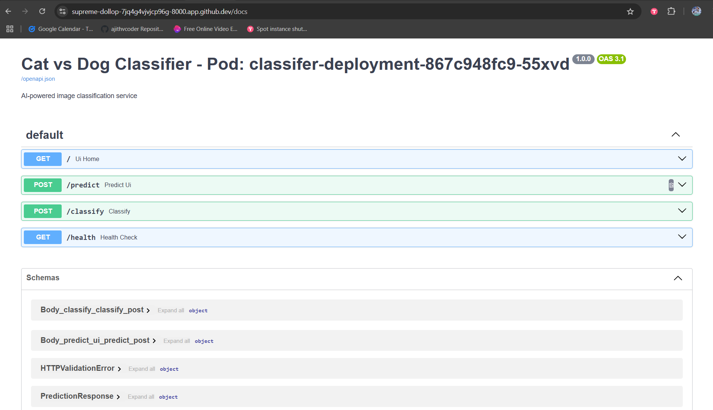
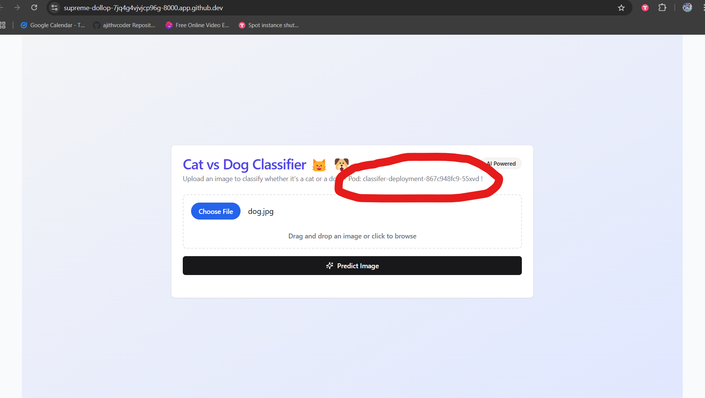
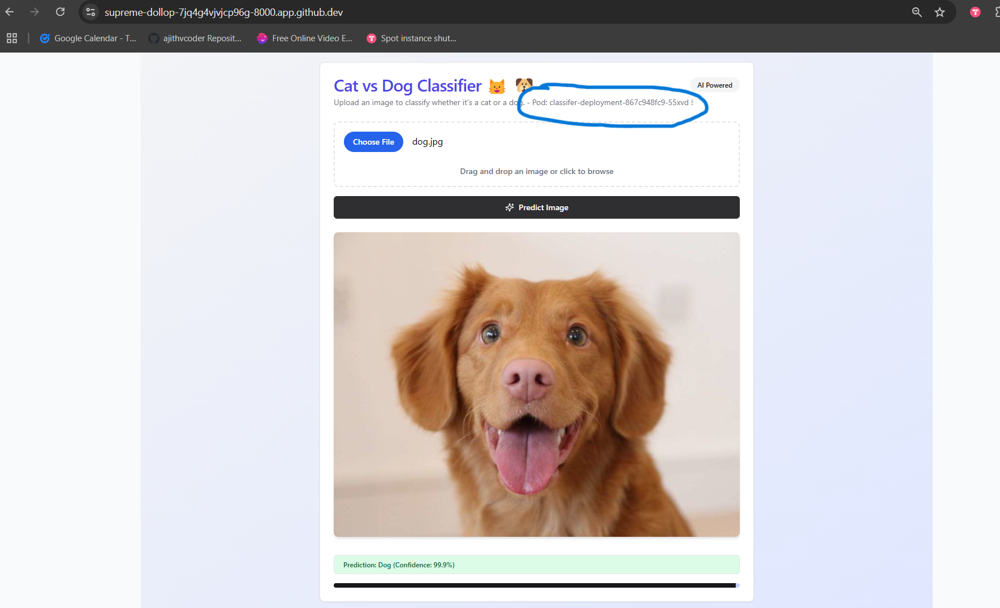
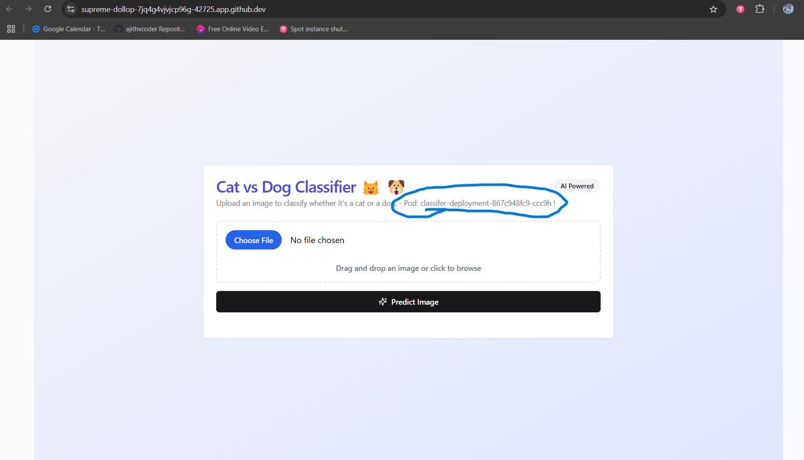

## EMLOV4-Session-13 Assignment - Kubernetes - I: Introduction

### Contents

- [Requirements](#requirements)
- [Development Method](#development-method)
    - [Classifier model gen and Fast Api local testing](#classifier-model-gen-and-fast-api-local-testing)
    - [Instructions to Deployment](#fast-api-service)
- [Learnings](#learnings)
- [Results Screenshots](#results-screenshots)

### Requirements

- Create a Minikube Cluster Locally or with a t3a.medium Instance on EC2
- Deploy the CatDog/Dog Breed Classifier model with FastAPI, use FastHTML for the frontend
- Your Deployment must have 2 Pods for the Model Service
- It should have a Service and an Ingress
- What to Submit
    - Github Repo with Deployment YAML Files
    - Instructions to
        - Start MiniKube
        - Create the Deployment
        - Tunnel to the Ingress
    - Access the FastAPI docs page
- Output of the following in a .md file in your repository
    - `kubectl describe <your_deployment>`
    - `kubectl describe <your_pod>`
    - `kubectl describe <your_ingress>`
    - `kubectl top pod`
    - `kubectl top node`
    - `kubectl get all -o yaml`

### Classifier model gen and Fast API local testing

- Use [assignment-10](https://github.com/ajithvcoder/emlo4-session-10-ajithvcoder) to generate desried classification model for Cat and dogs
- Convert torch model to onnx - `python dev/generate_onnx.py`
- Test onnx model with dog image - `python test_onnx.py`
- Upload to gdrive and use the id to get it
- eg: `gdown 1HHS<model-id>jSg4tCrNANY --output /workspace/mambaout_model.onnx`
- Fastapi framework is used for serving at port `8000`

**Docker local testing**

*pre deployment test*

- `docker build -t fastapi-classifier-k8s -f ./Dockerfile . --no-cache`

- `docker run -it  -e PORT=8000 -p 8000:8000  fastapi-classifier-k8s bash`

*Note if you are mounting the folder for debugging then you need to download mambaout_model.onnx again as i am downloading the model only inside docker and reducing the size of repo*

- `docker run -it -v /workspaces/emlo4-session-13-ajithvcoder:/workspace -e PORT=8000 -p 8000:8000  fastapi-classifier-k8s bash`

- `uvicorn app:app --host 0.0.0.0 --port 8000`

### Instructions to Deployment

#### Start MiniKube

Set alias name so that we can give `kubectl` instead of a command like this `minikube kubectl --` and note that you need to set this in each current terminal you are using

- `alias kubectl="minikube kubectl --"`

Start minikube service in ubuntu

- `minikube start`

Verify if minikube is started successfully

- `kubectl get all -n kube-system`

#### Create the Deployment

We need to push docker image in minikube docker environment to make use of it. So enable minikube docker environment

- `eval $(minikube docker-env)`

- `docker build -t fastapi-classifier-k8s -f ./Dockerfile . --no-cache`

- `eval $(minikube docker-env -u)`

Now enter the directory where .yml files are present and run below command to bring up the pod

- `kubectl apply -f .`

Verify if all are in running status

- `kubectl get pods`

Once the pods are successfully running forward the pod's port `8000`

- `kubectl port-forward service/classifier-service 8000:80`

#### Tunnel to the Ingress

*Only in your local machine only not in EC2 or codespaces*

- Configure in classifier-ingress.yaml also `host: ajith.fastapi`

- If you are using wsl for ubuntu for windows do below. if you are in linux or windows follow any one of below one

- In **wsl** go to `/etc/hosts`

    ```

    127.0.0.1       ajith.fastapi  localhost
    ```

- Also if you are using wsl you need to modify in **windows** too

- Open `C:\Windows\System32\drivers\etc\hosts` in administrator mode

    ```
    127.0.0.1       ajith.fastapi  localhost
    ```

*Tunnel setup*

- minikube service classifier-service
- minikube tunnel
- kubectl apply -f .

- `http://ajith.fastapi/` will work now in your local

**Snap minikube start**



**minikube dashboard**



### Learnings

- The systems docker images are different from the kubernetes docker images
so use `eval $(minikube docker-env)` to get inside kubernetes docker images and build docker images for minikube and then to exit it use `eval $(minikube docker-env -u)`.

- Docker mount will show directories properly only if in both host and inside continer if it matches else it wont work as predicted. eg: without `mamba_out.model` i mounted with  `docker run -it -v /workspaces/emlo4-session-13-ajithvcoder:/workspace -e PORT=8000 -p 8000:8000  fastapi-classifier-k8s bash` command but i was not able to get the `mamba_out.model`  inside container even though i am downloading it inside docker file. So later i identified that the issue is improper docker mount.

### Results

**Access the FastAPI docs page**



**Serving app screenshot with pod name**

Below you can see that pod name which is serving is used for prediction also



**Prediction screenshot**



**After refresh**

After refresh we can get new pod for a new request in round robin manner



**Report for given commands**

- [reports](./report.md)


### Group Members

1. Ajith Kumar V (myself)
2. Pravin Sagar
3. Hema M
